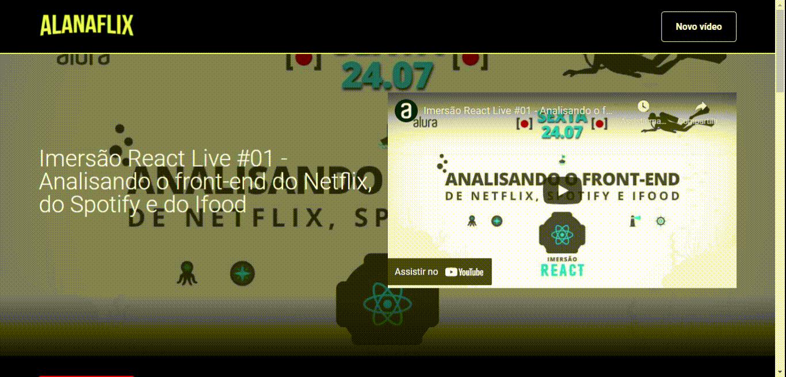

# AlanaFlix

## 💻 Sobre o projeto

O projeto AlanaFlix foi desenvolvido durante a primeira [Imersão React](https://site.alura.com.br/imersao) da [Alura](https://www.alura.com.br) em 2020, que contou com 5 aulas práticas para criar e colocar no ar uma aplicação React.

É um repositório de vídeos dividido por categorias, podemos adicionar novos vídeos e adicionar novas categorias escolhendo uma cor para ela.

<div align="center">
    
</div>

### Funcionalidades

- Tela inicial com os vídeos;
- Adicionar novo vídeo;
- Adicionar nova categoria;
  - Escolher cor da nova categoria.

## 🛠 Tecnologias

As seguintes ferramentas foram usadas na construção do projeto:

- [React](https://pt-br.reactjs.org/)
- [Styled Components](https://styled-components.com/)
- [json-server](https://www.npmjs.com/package/json-server)
- [Visual Studio Code](https://code.visualstudio.com/)
- [Firebase](https://firebase.google.com/) - base de dados

## 🔥 Como executar o projeto localmente

Para executar o projeto de maneira local, execute os comandos:

```sh
git clone https://github.com/alanabacco/alanaflix
cd alanaflix
npm install
npm run start
```

O navegador irá abrir em 'https://localhost:3000'.

---

Desenvolvido por [Alana Bacco](https://github.com/alanabacco). <br />
[](https://www.linkedin.com/in/alana-bacco/)
